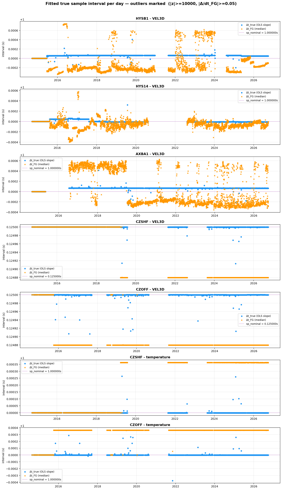
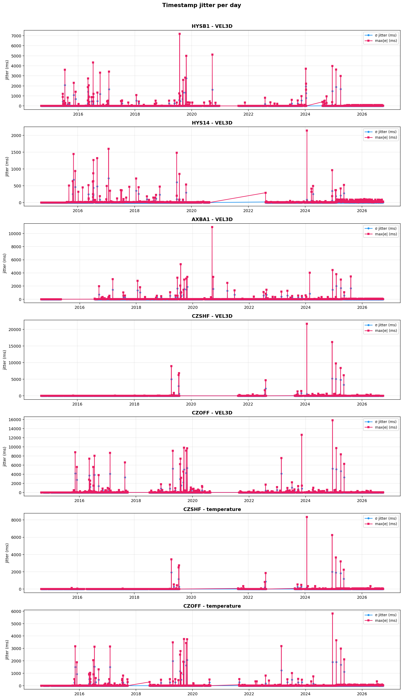
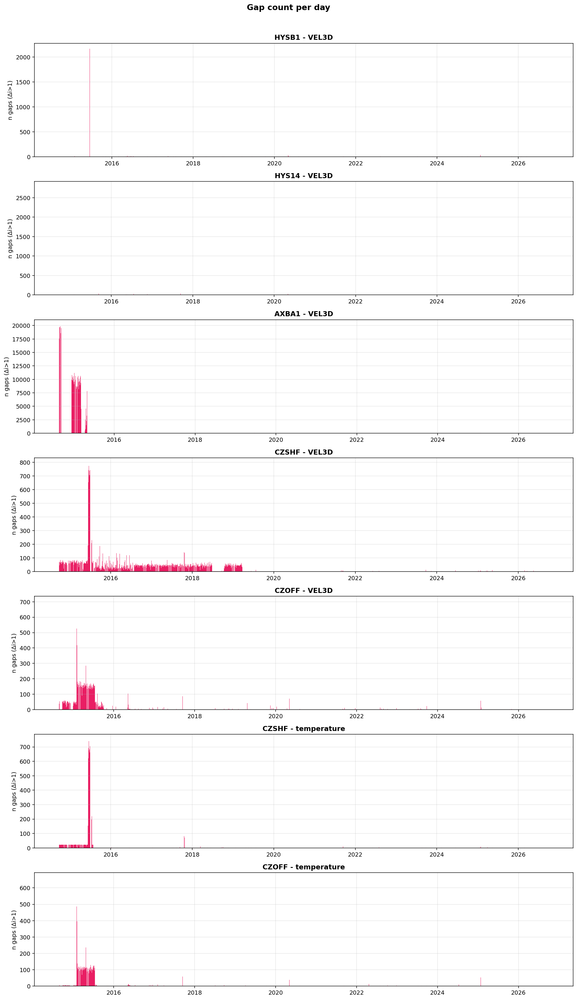

# Sea Water Velocity

OOI RCA Tier-3 3-D single-point current-meter (VEL3D) data collection: retrieval,
validation, conversion to MiniSEED / StationXML, and staging for SeedLink
(near-real-time) or the EarthScope Dropoff system (historical backfill;
replaces the retired miniseed2dmc client). Sibling of
[`absolute-seafloor-pressure`](https://github.com/coszo-hub/absolute-seafloor-pressure) (PREST);
same internal layout and pipeline.

The fleet spans **two instrument series**, which differ in vendor, sample rate, and
channel codes:

- **VEL3D Series C** — Nortek, **8 Hz**, on the Endurance array (`CE*`). Channels `MO?_20`. OOI streams `vel3d_cd_velocity_data` (velocity) and `vel3d_cd_system_data` (temperature).
- **VEL3D Series B** — Nobska MAVS-4, **1 Hz**, on the RSN cabled array (`RS*`). Channels `LO?_20`. OOI stream `vel3d_b_sample`.

## Stations

Velocity channels are eastward / northward / upward turbulent velocity (M/S):
`LOE`/`LON`/`LOZ` on Series B, `MOU`/`MOV`/`MOW` on Series C (U/V/W nonstandard-orientation
codes — as-installed orientation unverified). `LKO` is the instrument temperature
reading. The suffix (`_20`, or `_21` at CZOFF) is the SEED location code —
CZOFF's current instrument uses `21`; `20` is reserved for its future replacement.

| Reference | Site | OO Net.Sta | Series (rate) | Velocity / temp channels |
|---|---|---|---|---|
| `CE02SHBP-LJ01D-07-VEL3DC108` | Endurance OR Shelf Cabled Benthic | `OO.CZSHF` | C — Nortek (8 Hz) | `MOU_20`, `MOV_20`, `MOW_20`, `LKO_20` |
| `CE04OSBP-LJ01C-07-VEL3DC107` | Endurance OR Offshore Cabled Benthic | `OO.CZOFF` | C — Nortek (8 Hz) | `MOU_21`, `MOV_21`, `MOW_21`, `LKO_21` |
| `RS01SLBS-MJ01A-12-VEL3DB101` | RSN Hydrate Slope Base | `OO.HYSB1` | B — Nobska MAVS-4 (1 Hz) | `LOE_20`, `LON_20`, `LOZ_20`, `LKO_20` |
| `RS01SUM1-LJ01B-12-VEL3DB104` | RSN Hydrate Summit 1-4 | `OO.HYS14` | B — Nobska MAVS-4 (1 Hz) | `LOE_20`, `LON_20`, `LOZ_20`, `LKO_20` |
| `RS03AXBS-MJ03A-12-VEL3DB301` | RSN Axial Base | `OO.AXBA1` | B — Nobska MAVS-4 (1 Hz) | `LOE_20`, `LON_20`, `LOZ_20`, `LKO_20` |

## Deployments

Per-station deployment count and span, with sample rate. Full per-deployment epochs
(`c_start` / `c_end`) live in each channel's `VEL3D-data-collection/param/*_?O?_20.txt`.

| Station | Series | Deployments | First start | Status | Sample rate |
|---|---|---|---|---|---|
| `OO.CZSHF` | C | 13 | 2014-09-10 | ongoing | 8 Hz |
| `OO.CZOFF` | C | 13 | 2014-08-15 | ongoing | 8 Hz |
| `OO.HYSB1` | B | 3 | 2014-09-13 | ongoing | 1 Hz |
| `OO.HYS14` | B | 6 | 2014-09-09 | ongoing | 1 Hz |
| `OO.AXBA1` | B | 3 | 2014-08-08 | ongoing | 1 Hz |

## Timing summary

Daily timing QC for every series (panels: `<station> - VEL3D` velocity, `<station> - temperature`
for the VEL3D-C temperature stream), from `output/temporal_anomaly/metrics/*_variability.csv`.
Regenerate with `python bin/temporal_anomaly_investigator.py --mode plot --all-series` and `python bin/plot_dt_true_outliers.py`, and commit
the PNGs — this page always shows the committed versions.

**Fitted true sample interval per day** (OLS Δt_true vs median first guess vs nominal; red lines = outlier days from `bin/find_dt_true_outliers.py` logic)



**Timestamp jitter per day** (σ and max |residual|, ms)



**Gap count per day**



## Layout

```
sea-water-velocity/
├── README.md
├── .gitignore
└── VEL3D-data-collection/        ← pipeline code (see its README.md for full detail)
    ├── bin/                       ← *.py + *.sh: cron pipeline, metadata builder,
    │                                 backfill, gap_algorithms, diagnose_timing,
    │                                 temporal_anomaly_investigator, sync_metrics, etc.
    ├── param/                     ← run_vel3d.txt, run_metadata.txt, station +
    │                                 per-channel params (c_start/c_end, rates, streams)
    ├── run/                       ← endtime_*.txt pipeline state
    ├── crons_prest_seedlink_and_mseed2dmc.txt   ← inherited from PREST (VEL3D
    │                                 conversion pending — see CONVERSION_TODO.md)
    ├── testk/                     ← smoke-test scripts
    └── output/                    ← runtime working tree
        ├── mseed/                  ← seedlink MiniSEEDs (contents NOT tracked)
        ├── mseed2dmc/<YEAR>/       ← backfill MiniSEEDs pending drop-off (NOT tracked)
        ├── mseed2dmc_sent/<YEAR>/  ← MiniSEEDs archived after upload (NOT tracked)
        ├── xml/                    ← StationXML (only OO_*.xml TRACKED)
        ├── netcdf/                 ← optional raw .nc audit copies (NOT tracked)
        ├── metrics/                ← per-run pipeline_stats CSVs (TRACKED)
        ├── diagnostics/            ← diagnose_timing figures / CSVs (TRACKED)
        └── temporal_anomaly/       ← temporal_anomaly_investigator output
            ├── metrics/             ← <STATION>_variability.csv (TRACKED)
            ├── figures/             ← per_day/ + summary/ PNGs (TRACKED)
            └── netcdf/              ← raw .nc when --save-nc (NOT tracked; *.nc ignored)
```

## Workflows

### Live data — SeedLink path

All operations run through wrapper scripts in `bin/` (`run_ooi_requests.sh` →
`run_data_collection.sh`) that activate the conda env, load OOI credentials from
`.ooi_env`, resolve cron-safe paths, and prevent concurrent runs. **Python scripts
are never called directly from cron.** The VM clones this repo and runs the staggered
SeedLink + metadata + latency + metrics-sync window, mirroring the PREST sibling.

> The current `crons_*.txt` is still the inherited PREST crontab (PREST stations /
> `Tidal-Seafloor-Pressure` paths). Converting it to the five VEL3D references is a
> pending task — see `VEL3D-data-collection/CONVERSION_TODO.md`.

### Historical — local backfill

`bin/backfill_mseed_from_nc.py` walks saved NetCDFs and produces MiniSEEDs in
`output/mseed2dmc/<YEAR>/`, byte-compatible with the cron pipeline.

With `--source goldcopy` it instead reads OOI's pre-built **gold copy**
(`thredds.dataexplorer.oceanobservatories.org`, `ooigoldcopy/public/`) over
OPeNDAP — no M2M request queue, only the needed variables transferred
(~6 s per 8 Hz day), nothing stored but the MiniSEED. `temporal_anomaly_investigator.py
--source goldcopy --stream <s>` does the same for the timing CSVs (add
`--workers N` to run days in parallel). Use it for all VEL3D-B data and VEL3D-C
velocity; the gold-copy VEL3D-C `system_data` files have no temperature, so the
C-series `LKO` channel still comes from M2M (`--save-nc` + default `--source local`).

```
# one pull per day → MiniSEED + investigator CSV row (+ figure on gap days); re-runs resume
python bin/backfill_mseed_from_nc.py --source goldcopy --variability \
    --station CE02SHBP-LJ01D-07-VEL3DC108 --stream vel3d_cd_velocity_data \
    --start 2014-09-10 --end 2026-06-16
```

### Drop-off to EarthScope (replaces miniseed2dmc)

EarthScope's cloud **Dropoff** system supersedes the old miniseed2dmc client
(the inherited miniseed2dmc cron entries stay commented out). One-time setup on
the drop-off machine: install the CLI in its own env
(`conda create -n earthscope python=3.11 && conda run -n earthscope pip install earthscope-cli`;
the script also finds it in `ooi_env`), then `conda run -n earthscope es login`
(device-code flow; tokens persist and auto-refresh). Uploads run 16 files in
parallel (`DROPOFF_CONCURRENCY` to change). Workflow:

```
# if the staged files predate the 2026-08 code renames (CZSHF/CZOFF, U/V/W, loc 21):
python bin/fix_staged_mseed_codes.py --dry-run     # preview header/filename fixes
python bin/fix_staged_mseed_codes.py

bin/dropoff_earthscope.sh xml                      # StationXML first, so metadata is in place
bin/dropoff_earthscope.sh mseed --dry-run          # preview upload set
bin/dropoff_earthscope.sh mseed --archive          # upload; move sent files to mseed2dmc_sent/
bin/dropoff_earthscope.sh status                   # server-side validation summary
```

`--archive` only moves files when the CLI's summary reports every staged file
uploaded. `es dropoff upload` exits 0 even if some files fail its client-side
validation, so on any shortfall the staging dir is left intact (re-uploading a
key is safe) and the script exits non-zero.

Uploads land under the `vel3d/mseed/` and `vel3d/stationxml/` prefixes of the
account's dropoff space and are validated server-side
(RECEIVED → … → ACCEPTED, or FAILED with a message).

### Daily metrics sync

`bin/sync_metrics.sh` runs once per day on the VM:

```
git pull --rebase --autostash
git add VEL3D-data-collection/output/metrics/ VEL3D-data-collection/output/diagnostics/
git commit -m "metrics: sync <date>"
git push origin main
```

`output/metrics/<reference>_vel3d_pipeline_stats.csv` and
`output/diagnostics/*_vel3d.txt` are tracked directly — no copy step.

## Algorithm

`gap_algo` in `param/run_vel3d.txt` selects between `legacy` (median Δt + adaptive
multiplier × sample-period threshold) and `anomaly` (OLS Δt_true + integer-step +
`true_missing > 0` splitting). **Default: `anomaly`** as of 2026-04-29.

Both algorithms live in `bin/gap_algorithms.py` behind a single `detect_gaps()`
dispatcher shared by the cron pipeline, the local backfill, the testk smoke-tests, and
the plotting tools. The pipeline uses an absolute Δt threshold for clean file
splitting; the offline `temporal_anomaly_investigator.py` applies a stricter
integer-step + wall-clock criterion for data-quality characterisation (it separates
real gaps from timestamp jitter and records both `n_gaps_raw` and corrected `n_gaps`).

**MiniSEED trace breaks** (`mseed_segmenting` in `param/run_vel3d.txt`, or `--segmenting` on the
backfill): `timing` (default since 2026-10-01) starts a new trace at gaps *and* wherever the recorded
timestamps leave the regular grid by more than ½ sample (late-delivered bursts after outages, clock
steps, 1 s stretches stamped one sample off), so every written sample stays within ½ sample of OOI's
recorded time; a lone glitched stamp whose neighbours are on the grid keeps its grid slot. `gaps` is
the original behaviour (breaks at gaps only, start = first timestamp) and reproduces earlier output
byte-for-byte; on a 68-day sample it left runs of samples ≥ ½ sample off on 27 days (up to ~2 s at 1 Hz).

See `VEL3D-data-collection/README.md` for the full pipeline reference, credential
setup, the offline diagnostic tools, and the `*_variability.csv` schema.

## Other instrument repos

Sibling instrument repos in the `coszo-hub` organization share this internal layout:

- `coszo-hub/absolute-seafloor-pressure/PREST-data-collection/` — seafloor pressure (PREST)
- `coszo-hub/sea-water-velocity/VEL3D-data-collection/` — current meters (VEL3D, this repo)
